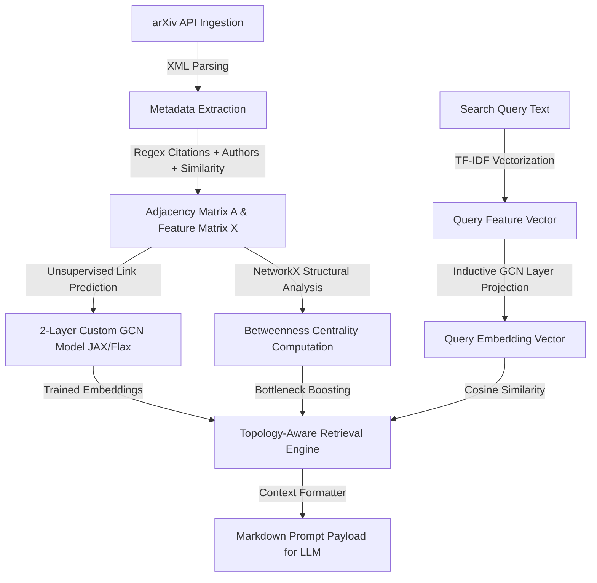

# Citation Cartography and Topology-Aware Graph-RAG Graphing

An automated research tool that ingests academic metadata from the arXiv API, constructs a citation and semantic relationship graph, trains a Graph Convolutional Network (GCN) from scratch for unsupervised representation learning, and executes topology-aware Graph-RAG queries using structural network bottleneck detection (Betweenness Centrality).

---

## Architecture Overview



### Core Components

1. **Ingestion Pipeline (`src/ingestion.py`)**:
   - Fetches papers from arXiv query endpoint with polite rate-limiting (3s delay) and pagination.
   - Extract title, abstract, authors, categories, and references.
   - Builds an L2-normalized TF-IDF term-document matrix from scratch as node features $X$.
   - Constructs a citation, co-authorship, and semantic-category similarity adjacency matrix $A$.
   - Offline fallback: generates synthetic mock graphs dynamically if the network/API fails.

2. **Custom GCN Layer (`src/gcn.py`)**:
   - Implemented from scratch using **JAX** and **Flax**.
   - Standard GCN forward rule: $H^{(l+1)} = \sigma( D^{-1/2} \tilde{A} D^{-1/2} H^{(l)} W^{(l)} )$.
   - Unsupervised training loop optimizing a Link Prediction binary cross-entropy loss via **Optax** to represent neighborhood topology in node embeddings.

3. **Topology-Aware Retrieval Engine (`src/retrieval.py`)**:
   - Computes normalized Betweenness Centrality via **NetworkX** to detect structural bottlenecks bridging communities.
   - Semantic query mapping via GCN dense layer inductive projection.
   - Neighborhood traversal starting from primary semantic hits, expanding to neighbors, and boosting/injecting bottleneck nodes to prevent RAG semantic silos.
   - Context formatter returning structured Markdown payload ready for LLM consumption.

---

## Installation & Setup

1. Create and activate a Python virtual environment:
   ```bash
   python3 -m venv .venv
   source .venv/bin/activate
   ```

2. Install dependencies:
   ```bash
   pip install numpy networkx jax flax optax requests scipy matplotlib
   ```

---

## How to Run

Run the end-to-end pipeline using the main script. The script will attempt to run a live query crawl on the arXiv API and fall back to synthetic mock data if the network is disconnected or API is slow.

### Run with Live API Crawl (Default)
```bash
python3 main.py --limit 30 --search "numerical solution methods for differential equations in physics"
```

### Run with Mock Data (Offline Mode)
```bash
python3 main.py --mock --limit 50 --search "unsupervised learning on graph networks"
```

### Command Line Arguments
- `--query`: arXiv search query (default: `cat:physics.comp-ph AND "numerical methods"`).
- `--limit`: Max number of papers to crawl/generate (default: `50`).
- `--features`: Dimensionality of TF-IDF feature space (default: `128`).
- `--hidden-dim`: GCN hidden dimension (default: `64`).
- `--out-dim`: GCN representation dimension (default: `32`).
- `--epochs`: GCN self-supervised epochs (default: `150`).
- `--lr`: Learning rate (default: `0.01`).
- `--alpha`: Topology centrality boosting factor (default: `0.4`).
- `--top-k`: Number of primary semantic hits to retrieve (default: `5`).
- `--bridges`: Number of bottleneck bridge neighbors to inject (default: `3`).
- `--search`: Search query text (default: `numerical solutions for differential equations in physics`).
- `--mock`: Force mock offline execution.
- `--viz-output`: Output filepath for the query graph network visualization (default: `query_graph.png`).
